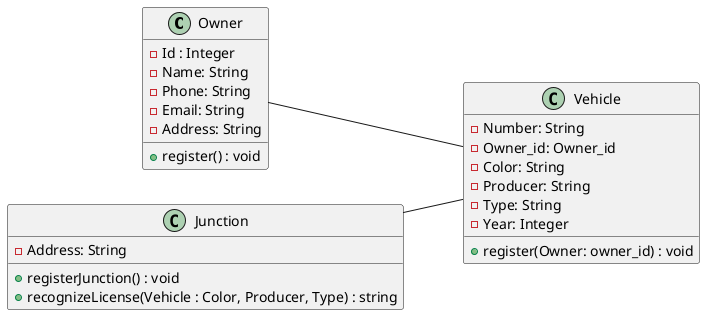
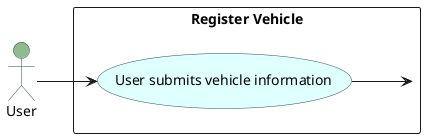
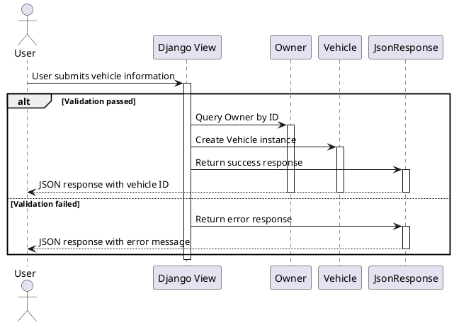
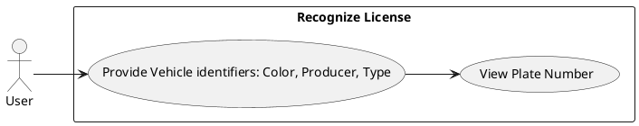
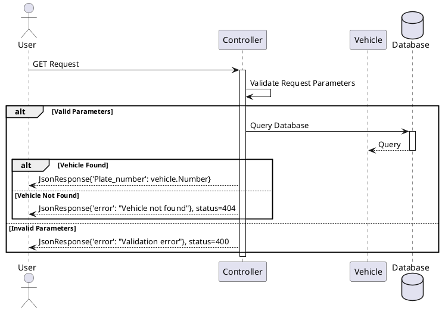

# traffic management system

PYTHON AND DJANGO

  
    HONGTAO AND VINCENT <carbon:arrow-right class="inline"/>
  

  <button @click="$slidev.nav.openInEditor()" title="Open in Editor" class="text-xl slidev-icon-btn opacity-50 !border-none !hover:text-white">
    <carbon:edit />
  </button>
  <a href="https://github.com/lzpmpc005/Traffic_Management_System" target="_blank" alt="GitHub" title="Open in GitHub"
    class="text-xl slidev-icon-btn opacity-50 !border-none !hover:text-white">
    <carbon-logo-github />
  </a>

<!--
The last comment block of each slide will be treated as slide notes. It will be visible and editable in Presenter Mode along with the slide. [Read more in the docs](https://sli.dev/guide/syntax.html#notes)
-->

---
layout: default
---

# Table of contents

<Toc maxDepth="1"></Toc> 
---

# Requirements

|     |     |
| --- | --- |
| <kbd>I</kbd> |  Register Vehicle |
| <kbd>II</kbd> | Simulate Recognizing License |

---

# Class Diagram

:::figcaption
We defined three classes: Junction, Vehicle, Owner. 
We use phone number to distinguish each owner. 
We use owner_id to connect each vehicle to its owner.
We use "color + producer + type" to recognize vehicles.
:::

---
layout: image-left
image: https://images.unsplash.com/photo-1517676109075-9a94d44145d1?q=80&w=3648&auto=format&fit=crop&ixlib=rb-4.0.3&ixid=M3wxMjA3fDB8MHxwaG90by1wYWdlfHx8fGVufDB8fHx8fA%3D%3D
---

# Part I register vehicle

This part design the models about the vehicle![^1]

<arrow v-click="[3, 4]" x1="400" y1="420" x2="230" y2="330" color="#564" width="3" arrowSize="1" />

[^1]: [Learn More](https://sli.dev/guide/syntax.html#line-highlighting)

---
transition: slide-up
level: 2
---

# Rigester_vehicle

### vehicle details

|     |     |
| --- | --- |
| <kbd>nubmer</kbd> |  models.CharField(max_length=10) |
| <kbd>owner_id</kbd> | database allocation id |
| <kbd>color</kbd> | models.CharField(max_length=10) |
| <kbd>producer</kbd> | models.CharField(max_length=10) |
| <kbd>type</kbd> | models.CharField(max_length=10) |
| <kbd>year</kbd> | models.IntegerField |

---

# Register_Vehicle: Usecase Diagram

:::figcaption

:::
This diagram illustrates the interaction between the "User" and the "Register Vehicle" use case. The user submits vehicle information, which triggers the "Register Vehicle" use case.

---

# Register_Vehicle: Sequence Diagram

:::figcaption
Sequence Diagram:
This diagram illustrates the sequence of interactions between the "User", "Django View", "Owner", "Vehicle", and "JsonResponse" during the vehicle registration process. The user submits vehicle information, which is processed by the Django view. If validation passes, the view queries the owner, creates a vehicle instance, and returns a success response. If validation fails, it returns an error response.
:::

---

# Part II Recognize Vehicle Plate Number

## Recognize_Vehicle: Usecase Diagram

---

# Recognize_Vehicle: Sequence Diagram

