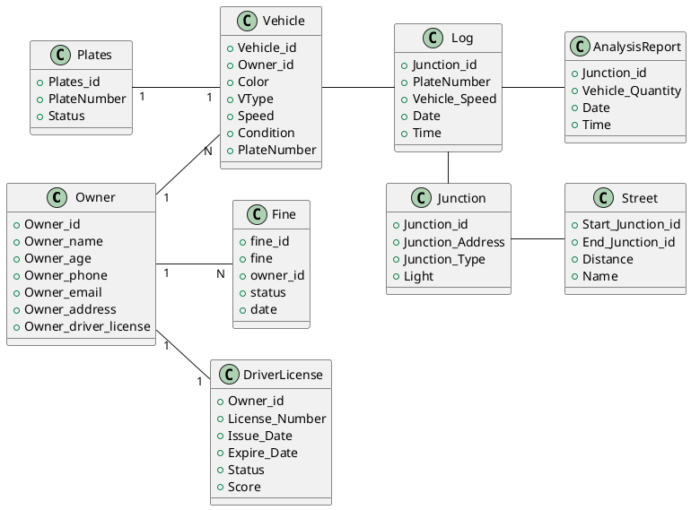
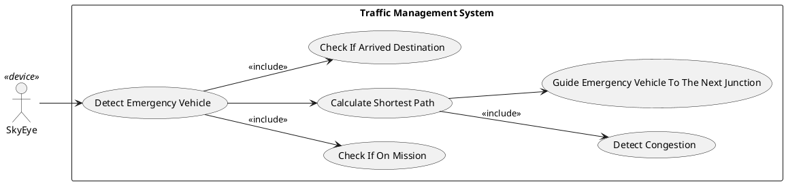
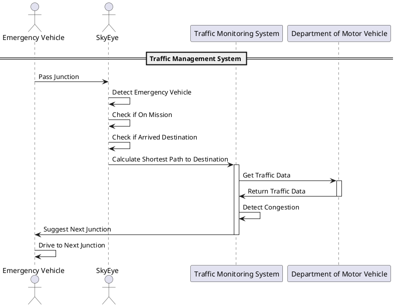
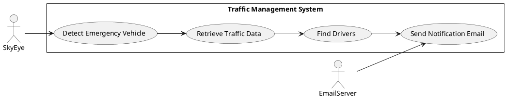
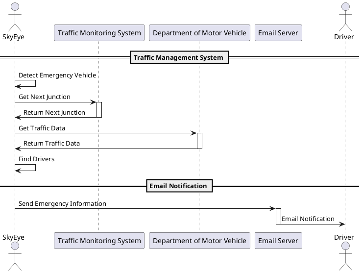

# Traffic Management System 4.0   

  <button title="Open in python" class="text-xl slidev-icon-btn  !border-none !hover:text-white">
    
  </button>
  <button title="Open in django" class="text-xl slidev-icon-btn  !border-none !hover:text-white">
    
  </button>
  <button title="Open in PostgreSQL" class="text-xl slidev-icon-btn  !border-none !hover:text-white">
    
  </button>

  
    HONGTAO AND VINCENT <carbon:arrow-right class="inline"/>
  

20/02/2024

  <button @click="$slidev.nav.openInEditor()" title="Open in Editor" class="text-xl slidev-icon-btn opacity-50 !border-none !hover:text-white">
    <carbon:edit />
  </button>
  <a href="https://github.com/lzpmpc005/Traffic_Management_System" target="_blank" alt="GitHub" title="Open in GitHub"
    class="text-xl slidev-icon-btn opacity-50 !border-none !hover:text-white">
    <carbon-logo-github />
  </a>

<!--
The last comment block of each slide will be treated as slide notes. It will be visible and editable in Presenter Mode along with the slide. [Read more in the docs](https://sli.dev/guide/syntax.html#notes)
-->

---

# Tasks

|     |     |
| --- | --- |
| <kbd>I</kbd> | Implement A MAP |
| <kbd>II</kbd> | Detect Emergency Vehicles And Provide instructions |
| <kbd>III</kbd> | Calculate Shortest Path And Avoid Congestion |
| <kbd>IV</kbd> | Email Drivers Ahead To Clear The Streets |

---

# Class Diagram

 

 

---

# Part I THE MAP

---

# Part I THE MAP

---

# Part I THE MAP

---

# Part II Detect Emergency Vehicle & Guide

## Usecase Diagram

---

# Part II Detect Emergency Vehicle & Guide
## Sequence Diagram

 

 

---
layout: default
---

# Part III Notify Drivers To Clear the Way

## Usecase Diagram

### Notification Range:   
#### Drivers who passed current junction and next junction on the path of emergency vehicle within one minute.

---

# Part III Notify Drivers To Clear the Way

## Sequence Diagram

 

 

 
---
layout: center
class: text-center
---

# Thank you for watching

[GitHub](https://github.com/lzpmpc005/Traffic_Management_System/tree/main)
