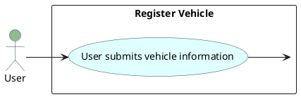
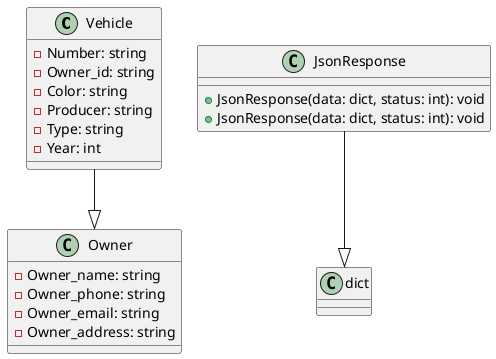
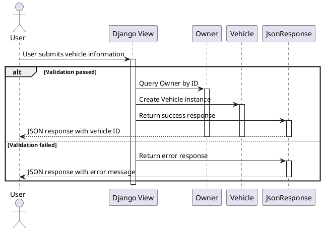

# traffic management system

PYTHON AND DJANGO

<div class="pt-12">
  <span @click="$slidev.nav.next" class="px-2 py-1 rounded cursor-pointer" hover="bg-white bg-opacity-10">
    HONGTAO AND VINCENT <carbon:arrow-right class="inline"/>
  </span>
</div>

<div class="abs-br m-6 flex gap-2">
  <button @click="$slidev.nav.openInEditor()" title="Open in Editor" class="text-xl slidev-icon-btn opacity-50 !border-none !hover:text-white">
    <carbon:edit />
  </button>
  <a href="https://github.com/lzpmpc005/Traffic_Management_System" target="_blank" alt="GitHub" title="Open in GitHub"
    class="text-xl slidev-icon-btn opacity-50 !border-none !hover:text-white">
    <carbon-logo-github />
  </a>
</div>

<!--
The last comment block of each slide will be treated as slide notes. It will be visible and editable in Presenter Mode along with the slide. [Read more in the docs](https://sli.dev/guide/syntax.html#notes)
-->


---
layout: default
---

# Table of contents


<Toc maxDepth="1"></Toc> 

---
layout: image-left
image: https://images.unsplash.com/photo-1517676109075-9a94d44145d1?q=80&w=3648&auto=format&fit=crop&ixlib=rb-4.0.3&ixid=M3wxMjA3fDB8MHxwaG90by1wYWdlfHx8fGVufDB8fHx8fA%3D%3D
---

# Part 1 register vehicle

This part design the models about the vehicle![^1]


<arrow v-click="[3, 4]" x1="400" y1="420" x2="230" y2="330" color="#564" width="3" arrowSize="1" />

[^1]: [Learn More](https://sli.dev/guide/syntax.html#line-highlighting)

<style>
.footnotes-sep {
  @apply mt-20 opacity-10;
}
.footnotes {
  @apply text-sm opacity-75;
}
.footnote-backref {
  display: none;
}
</style>
---
transition: slide-up
level: 2
---

## Rigester_vehicle

Hover on the bottom-left corner to see the navigation's controls panel, [learn more](https://sli.dev/guide/navigation.html)

### vehicle details

|     |     |
| --- | --- |
| <kbd>nubmer</kbd> |  models.CharField(max_length=10) |
| <kbd>owner_id</kbd> | database allocation id |
| <kbd>color</kbd> | models.CharField(max_length=10) |
| <kbd>producer</kbd> | models.CharField(max_length=10) |
| <kbd>type</kbd> | models.CharField(max_length=10) |
| <kbd>year</kbd> | models.IntegerField |
<!-- https://sli.dev/guide/animations.html#click-animations -->

<p v-after class="absolute bottom-23 left-45 opacity-30 transform -rotate-10">Here!</p>


---

# Components

<div grid="~ cols-2 gap-4">
<div>

You can use Vue components directly inside your slides.

We have provided a few built-in components like `<Tweet/>` and `<Youtube/>` that you can use directly. And adding your custom components is also super easy.

```html
<Counter :count="10" />
```

<!-- ./components/Counter.vue -->
<Counter :count="10" m="t-4" />

Check out [the guides](https://sli.dev/builtin/components.html) for more.

</div>
<div>

```html
<Tweet id="1390115482657726468" />
```

<Tweet id="1390115482657726468" scale="0.65" />

</div>
</div>

<!--
Presenter note with **bold**, *italic*, and ~~striked~~ text.

Also, HTML elements are valid:
<div class="flex w-full">
  <span style="flex-grow: 1;">Left content</span>
  <span>Right content</span>
</div>
-->

---
class: px-20
---

# Themes

Slidev comes with powerful theming support. Themes can provide styles, layouts, components, or even configurations for tools. Switching between themes by just **one edit** in your frontmatter:

<div grid="~ cols-2 gap-2" m="t-2">

```yaml
---
theme: default
---
```

```yaml
---
theme: seriph
---
```


</div>

Read more about [How to use a theme](https://sli.dev/themes/use.html) and
check out the [Awesome Themes Gallery](https://sli.dev/themes/gallery.html).

---
preload: false
---

# Animations

Animations are powered by [@vueuse/motion](https://motion.vueuse.org/).

```html
<div
  v-motion
  :initial="{ x: -80 }"
  :enter="{ x: 0 }">
  Slidev
</div>
```

<div class="w-60 relative mt-6">
  <div class="relative w-40 h-40">
    
    
    
  </div>

  <div
    class="text-5xl absolute top-14 left-40 text-[#2B90B6] -z-1"
    v-motion
    :initial="{ x: -80, opacity: 0}"
    :enter="{ x: 0, opacity: 1, transition: { delay: 2000, duration: 1000 } }">
    Slidev
  </div>
</div>

<!-- vue script setup scripts can be directly used in markdown, and will only affects current page -->
<script setup lang="ts">
const final = {
  x: 0,
  y: 0,
  rotate: 0,
  scale: 1,
  transition: {
    type: 'spring',
    damping: 10,
    stiffness: 20,
    mass: 2
  }
}
</script>

<div
  v-motion
  :initial="{ x:35, y: 40, opacity: 0}"
  :enter="{ y: 0, opacity: 1, transition: { delay: 3500 } }">

[Learn More](https://sli.dev/guide/animations.html#motion)

</div>

---


---

# Diagrams

See different diagrams for function vehicle_register.

<div class="grid grid-cols-1 gap-5 pt-4 -mb-6">



:::figcaption
Use Case Diagram:
:::
This diagram illustrates the interaction between the "User" and the "Register Vehicle" use case. The user submits vehicle information, which triggers the "Register Vehicle" use case.


[Learn More](https://sli.dev/guide/syntax.html#diagrams)
</div>


---

# Diagrams

See different diagrams for function vehicle_register.

<div class="grid grid-cols-2 gap-5 pt-4 -mb-6">


:::figcaption
Class Diagram:This diagram depicts the class structure of the Django models involved in the vehicle registration process: "Vehicle", "Owner", and "JsonResponse". "Vehicle" has attributes such as Number, Owner_id, Color, Producer, Type, and Year. "Owner" has attributes related to owner information. "JsonResponse" represents the response format used in the Django views.
:::


[Learn More](https://sli.dev/guide/syntax.html#diagrams)
</div>


---

# Diagrams

See different diagrams for function vehicle_register.

<div class="grid grid-cols-2 gap-5 pt-4 -mb-6">



:::figcaption
Sequence Diagram:
This diagram illustrates the sequence of interactions between the "User", "Django View", "Owner", "Vehicle", and "JsonResponse" during the vehicle registration process. The user submits vehicle information, which is processed by the Django view. If validation passes, the view queries the owner, creates a vehicle instance, and returns a success response. If validation fails, it returns an error response.
:::

[Learn More](https://sli.dev/guide/syntax.html#diagrams)


</div>


---
src: ./pages/multiple-entries.md
hide: false
---

---
layout: center
class: text-center
---

# Learn More

[Documentations](https://sli.dev) · [GitHub](https://github.com/slidevjs/slidev) · [Showcases](https://sli.dev/showcases.html)
