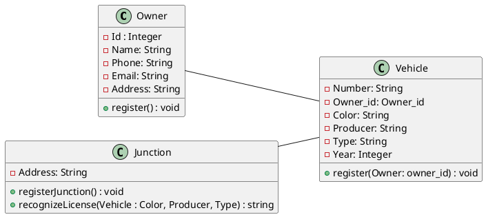
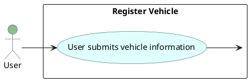
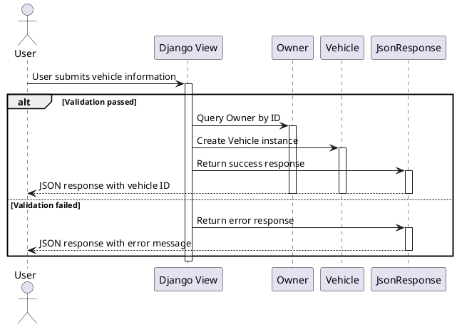
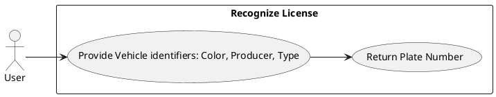
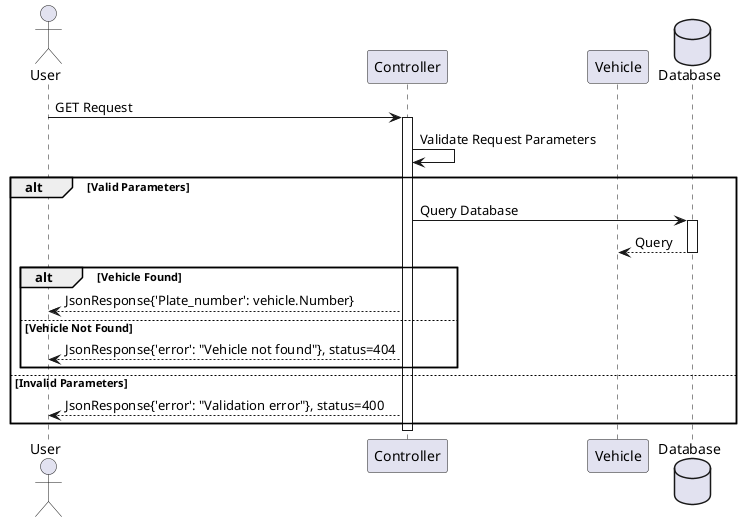

# Traffic Management System 1.0   


<div class="absolute top-1/1.9 left-1/2 transform -translate-x-1/2 -translate-y-1/2">
  <button title="Open in python" class="text-xl slidev-icon-btn  !border-none !hover:text-white">
    
  </button>
  <button title="Open in django" class="text-xl slidev-icon-btn  !border-none !hover:text-white">
    
  </button>
  <button title="Open in PostgreSQL" class="text-xl slidev-icon-btn  !border-none !hover:text-white">
    
  </button>
</div>

<div class="pt-12">
  <span @click="$slidev.nav.next" class="px-2 py-1 rounded cursor-pointer" hover="bg-white bg-opacity-10">
    HONGTAO AND VINCENT <carbon:arrow-right class="inline"/>
  </span>
</div>
29/01/2024

<div class="abs-br m-6 flex gap-2">
  <button @click="$slidev.nav.openInEditor()" title="Open in Editor" class="text-xl slidev-icon-btn opacity-50 !border-none !hover:text-white">
    <carbon:edit />
  </button>
  <a href="https://github.com/lzpmpc005/Traffic_Management_System" target="_blank" alt="GitHub" title="Open in GitHub"
    class="text-xl slidev-icon-btn opacity-50 !border-none !hover:text-white">
    <carbon-logo-github />
  </a>
</div>

<!--
The last comment block of each slide will be treated as slide notes. It will be visible and editable in Presenter Mode along with the slide. [Read more in the docs](https://sli.dev/guide/syntax.html#notes)
-->


---
layout: default
---

# Table of contents


<Toc maxDepth="1"></Toc> 
---

# Requirements

|     |     |
| --- | --- |
| <kbd>I</kbd> |  Register Vehicle |
| <kbd>II</kbd> | Simulate Recognizing License |

---

# Class Diagram

<div class="grid grid-cols-1 gap-5 pt-4 -mb-6">


:::figcaption
We defined three classes: Junction, Vehicle, Owner.   
We use phone number to distinguish each owner.   
We use owner_id to connect each vehicle to its owner.   
We use "color + producer + type" to recognize vehicles.
:::

</div>


---


# Register Vehicle Highlights

Django view function for handling a POST request to register a vehicle. 

<v-click>
<div
  v-motion
  :initial="{ x: -80 }"
  :enter="{ x: 0 }">

- Checks if required fields exist and if their types are correct.
</div>
</v-click>
<v-click>
<div
  v-motion
  :initial="{ x: -80 }"
  :enter="{ x: 0 }">
  
- Ensures that the plate number, color, producer, and type are strings and do not contain numbers or special characters.

</div>
</v-click>
<v-click>
<div
  v-motion
  :initial="{ x: -80 }"
  :enter="{ x: 0 }">
  
- Verifies that the year is an integer.
</div>
</v-click>


<style>
.footnotes-sep {
  @apply mt-20 opacity-10;
}
.footnotes {
  @apply text-sm opacity-75;
}
.footnote-backref {
  display: none;
}
</style>
---
transition: slide-up
level: 2
---

## Rigester Vehicle Details
 
Show how to define the details of cars, [See more.](https://github.com/lzpmpc005/Traffic_Management_System/blob/main/traffic_management_system/traffic_management/views.py)


|     |     |
| --- | --- |
| <kbd>nubmer</kbd> |  models.CharField(max_length=10) |
| <kbd>owner_id</kbd> | database allocation id |
| <kbd>color</kbd> | models.CharField(max_length=10) |
| <kbd>producer</kbd> | models.CharField(max_length=10) |
| <kbd>type</kbd> | models.CharField(max_length=10) |
| <kbd>year</kbd> | models.IntegerField |

---
preload: false
---

# Code

<v-click>
<div
  v-motion
  :initial="{ x: -80 }"
  :enter="{ x: 0 }">
  
  Check code here directly or check [full project](https://github.com/lzpmpc005/Traffic_Management_System/tree/main).
</div>
</v-click>

<v-click>
<div
  v-motion
  :initial="{ x: -80 }"
  :enter="{ x: 0 }">
  
  
</div>
</v-click>
<div class="grid grid-cols-2 gap-5 pt-4 -mb-6">
<div style="overflow-y: auto; max-height: 340px;">

```python
class Vehicle(models.Model):
    Number = models.CharField(max_length=10)
    Owner = models.ForeignKey(Owner, on_delete=models.SET_NULL, null=True)
    Color = models.CharField(max_length=10)
    Producer = models.CharField(max_length=10)
    Type = models.CharField(max_length=10)
    Year = models.IntegerField()
    def __str__(self) -> str:
        return self.Number
```
</div>

<div style="overflow-y: auto; max-height: 340px;">

```python
@csrf_exempt
def register_vehicle(request):
    if request.method == 'POST':
        try:
            data = json.loads(request.body.decode("utf-8"))

            number = data.get("number")
            owner_id = data.get("owner_id")
            color = data.get("color")
            producer = data.get("producer")
            type = data.get("type")
            year = data.get("year")

            if not number or number == "":
                return JsonResponse({'error': "Plate_number not specified"}, status=400)
            if not isinstance(number, str):
                return JsonResponse({'error': "Plate_number should be string!"}, status=400)

            if not owner_id or owner_id == "":
                return JsonResponse({'error': "Owner_id not specified"}, status=400)

            if not color or color == "":
                return JsonResponse({'error': "color not specified"}, status=400)
            if not isinstance(color, str):
                return JsonResponse({'error': "color should be string!"}, status=400)

            if not producer or producer == "":
                return JsonResponse({'error': "producer not specified"}, status=400)
            if not isinstance(producer, str):
                return JsonResponse({'error': "producer should be string!"}, status=400)
            if re.search(sc_number, producer):
                return JsonResponse({'error': "producer contains number or special character"}, status=400)

            if not type or type == "":
                return JsonResponse({'error': "type not specified"}, status=400)
            if not isinstance(type, str):
                return JsonResponse({'error': "type should be string!"}, status=400)
            if re.search(sc_number, type):
                return JsonResponse({'error': "type contains number or special character"}, status=400)

            if not year or year  == "":
                return JsonResponse({'error': "year  not specified"}, status=400)
            if not isinstance(year, int):
                return JsonResponse({'error': "year  should be integer!"}, status=400)     

            owner = Owner.objects.filter(id=owner_id).first()
            if not owner:
                return JsonResponse({'error': "Owner does not exist"}, status=400)

            vehicle = Vehicle.objects.create(Number=number, Owner=owner, Color=color, Producer=producer, Type=type, Year=year)
            return JsonResponse({'vehicle_id': vehicle.id})
        except Exception as e:
            return JsonResponse({'error': str(e)}, status=400)
```
</div>


</div>

---

# Register_Vehicle: Usecase Diagram

<div class="grid grid-cols-1 gap-5 pt-4 -mb-6">



:::figcaption
Use Case Diagram:
:::
<v-click>
<div
  v-motion
  :initial="{ x: -80 }"
  :enter="{ x: 0 }">

  The interaction between the "User" and the "Register Vehicle" use case. The user submits vehicle information, which triggers the "Register Vehicle" use case.
</div>
</v-click>

</div>


---

# Register_Vehicle: Sequence Diagram

<div class="grid grid-cols-2 gap-5 pt-4 -mb-6">


<v-click>
<div
  v-motion
  :initial="{ x: -80 }"
  :enter="{ x: 0 }">

  The "User" interacts with the "Django View", "Owner", "Vehicle", and "JsonResponse" during vehicle registration. The user submits vehicle info, which the view processes. If it's valid, the view creates a vehicle and sends a success response; if not, it sends an error response.
</div>
</v-click>

</div>

---

# Part II Recognize Vehicle Plate Number

## Usecase Diagram

<div class="grid grid-cols-1 gap-5 pt-4 -mb-6">



</div>

---

# Recognize_Vehicle: Sequence Diagram


<div class="grid grid-cols-1 gap-1 pt-0 -mb-6">



</div>

---
layout: center
class: text-center
---

# Thank you for watching

[GitHub](https://github.com/lzpmpc005/Traffic_Management_System/tree/main) 